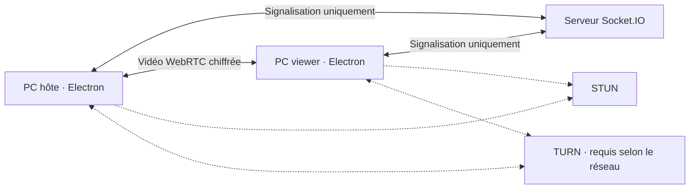

# Architecture

Le serveur gère les codes, demandes, permissions et messages SDP/ICE. Le flux écran passe directement par WebRTC. Le transfert de fichiers et les entrées passent encore partiellement par Socket.IO : leur migration vers des DataChannels séparés est prioritaire.

La migration cible est `src/main`, `src/preload`, `src/renderer`, `src/server`, `src/shared`, `src/services` et `src/tests`. `src/shared/validation.js` constitue la première étape.
