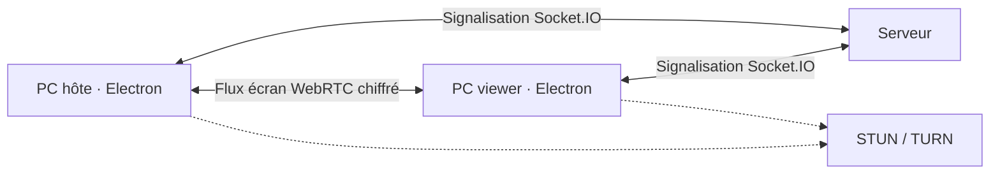

<p align="center"></p>

# Madrador Remote

[](https://github.com/Madrador60/partager-son-ecran/actions/workflows/ci.yml)
[](https://github.com/Madrador60/partager-son-ecran/releases/latest)
[](https://github.com/Madrador60/partager-son-ecran/releases/latest)

Application Windows d’assistance à distance visible et consentie. Madrador Remote permet de partager un écran, contrôler un poste autorisé, discuter et échanger des fichiers ou du texte.

L’application démarre automatiquement un serveur de signalisation intégré en
arrière-plan. Pour les essais locaux ou sur un même ordinateur, aucune commande
`npm run server` n’est nécessaire. Un serveur public commun reste nécessaire pour
relier automatiquement deux réseaux Internet différents.

> **Projet en développement.** Madrador Remote est actuellement un MVP Windows. Il ne remplace pas encore un service commercial comme AnyDesk, ne garantit aucune latence nulle et ne doit jamais être utilisé sans consentement.

## Télécharger

Le bouton du site interroge l’API GitHub côté serveur avec un cache de dix minutes puis télécharge directement l’installateur `.exe` de la dernière release stable. La version, la taille, la date et les notes de version sont alimentées par cette API : aucune modification du HTML n’est nécessaire lors d’une publication.

La page [Releases](https://github.com/Madrador60/partager-son-ecran/releases) sert uniquement de secours, d’historique et de consultation des checksums. Sans release contenant un fichier `Madrador-Remote-Setup-*.exe`, le téléchargement direct ne peut pas fonctionner.

## Utiliser Madrador Remote dans un navigateur

La page `/remote` propose deux modes : **Partager mon PC** et **Se connecter à un PC**. Un navigateur récent peut héberger une session en partageant un écran, une fenêtre ou un onglet via `getDisplayMedia()`, ou rejoindre une session existante.

1. ouvrir l’application ou le site sur le PC distant ;
2. choisir l’écran, la fenêtre ou l’onglet puis créer un code ;
3. ouvrir `/remote` sur le site Madrador Remote ;
4. saisir le code à neuf chiffres ;
5. accepter la demande sur le PC distant ;
6. utiliser la session dans le navigateur.

| Fonction | Application Windows | Interface web |
| --- | ---: | ---: |
| Héberger une session | Oui | Oui, avec `getDisplayMedia()` |
| Se connecter à un PC | Oui | Oui |
| Voir l’écran distant | Oui | Oui |
| Contrôle souris | Oui | Oui comme viewer ; non comme hôte navigateur |
| Contrôle clavier | Oui | Partiel comme viewer ; non comme hôte navigateur |
| Transfert de fichiers | Limité | Limité, par DataChannel |
| Presse-papiers texte | Oui | Limité par le navigateur |
| Accès sans surveillance | Non | Non |
| Service Windows | Non | Non |
| Installation nécessaire | Oui | Non pour le viewer |

Le navigateur ne peut pas devenir un agent Windows permanent, injecter des actions dans Windows quand il héberge une session, ni intercepter certains raccourcis système. L’interface désactive ces permissions et explique la limite. L’application reste nécessaire pour le contrôle complet et l’accès système.

## Site public

Le site est préparé pour être publié automatiquement avec GitHub Pages :

https://madrador60.github.io/partager-son-ecran/

La partie statique permet de télécharger l’application, partager un écran et rejoindre
une session. Les connexions distantes dépendent du serveur public configuré dans les
variables GitHub `MADRADOR_PUBLIC_API_URL` et `MADRADOR_SIGNAL_URL`.

## Fonctionnalités disponibles

- code temporaire à neuf chiffres ;
- durée illimitée par défaut ou arrêt automatique configurable ;
- approbation obligatoire sur le PC partagé ;
- choix de l’écran ou de la fenêtre ;
- contrôle clavier et souris révocable ;
- prise en charge des écrans secondaires ;
- discussion, presse-papiers texte et fichiers jusqu’à 25 Mo ;
- permissions séparées pour chaque session ;
- arrêt immédiat depuis les deux ordinateurs.

## Expérience Windows

L’application Electron propose une interface complète conçue pour rester lisible pendant une assistance :

- tableau de bord avec état du poste, serveur, IP locale, qualité réseau et version ;
- carte « Votre appareil » avec copie du code, expiration et disponibilité ;
- appareils récents, historique local consultable et reconnexion rapide ;
- espace de session centré sur la vidéo avec zoom, plein écran et statistiques ;
- panneaux latéraux pour le chat, les fichiers, le presse-papiers et les permissions ;
- paramètres organisés par catégories, interface de mise à jour et notifications non bloquantes ;
- splash screen et menu dans la zone de notification Windows.

Le menu de la zone de notification permet de rouvrir l’application, copier l’ID actif, changer la disponibilité, arrêter les connexions et quitter. Fermer la fenêtre réduit l’application dans cette zone ; utilisez **Quitter** pour arrêter complètement Madrador Remote.

L’interface respecte `prefers-reduced-motion`. Les statistiques WebRTC sont relevées à intervalle limité afin d’éviter une charge inutile pendant la vidéo.

## États du site web

La page `/remote` affiche séparément le choix du mode, la capture, le code hôte, l’attente d’autorisation, la négociation WebRTC, les erreurs récupérables et la session active. Pendant une session, la vidéo occupe l’espace principal et les outils moins fréquents sont regroupés dans des panneaux latéraux. Le site utilise le même serveur Socket.IO et la même connexion WebRTC que l’application Windows, ce qui permet navigateur ↔ application et navigateur ↔ navigateur selon les capacités de chaque plateforme.

## Expérimental ou planifié

- reconnexion avancée et jetons de reprise ;
- DataChannels spécialisés et transfert avec reprise ;
- audio système ;
- TURN temporaire et déploiement multi-instance ;
- qualité adaptative et négociation avancée des codecs ;
- multi-écrans avancé, appareils de confiance et accès sans surveillance.

## Architecture



Consultez [ARCHITECTURE.md](ARCHITECTURE.md) et [AUDIT.md](AUDIT.md) pour l’état technique réel.

## Structure du dépôt

| Dossier | Rôle |
| --- | --- |
| `public/` | Interface de l’application Electron |
| `server/` | Serveur de signalisation Socket.IO |
| `website/` | Site public de présentation |
| `scripts/` | Tests, sécurité et diagnostic |

## Lancer le site localement

Sous Windows, double-cliquez sur `LANCER-LE-SITE.bat`. Le script installe les dépendances si nécessaire, ouvre `http://127.0.0.1:3000` et garde le serveur actif jusqu’à la fermeture de la fenêtre.

## Développement

Prérequis : Node.js 22, npm, Git, Windows 10 ou 11 et, si la dépendance native doit être reconstruite, Visual Studio Build Tools.

```powershell
npm install
npm run verify
```

Utilisez ensuite deux terminaux.

Terminal 1 — serveur et site :

```powershell
npm run server
```

Terminal 2 — application :

```powershell
npm start
```

L’application utilise `http://127.0.0.1:3000` par défaut.

## Configuration Internet

Copiez `.env.example` vers `.env`. Le fichier est chargé automatiquement au démarrage et reste exclu de Git.

```powershell
Copy-Item .env.example .env
```

Variables principales :

| Variable | Utilisation |
| --- | --- |
| `PORT`, `HOST` | Adresse d’écoute du serveur |
| `PUBLIC_ORIGIN` | Domaine HTTPS autorisé |
| `MAX_FILE_MB` | Taille maximale d’un fichier |
| `MADRADOR_SIGNAL_URL` | URL HTTPS du serveur utilisée par l’application |
| `MADRADOR_TURN_URL` | Adresse du serveur TURN |
| `MADRADOR_TURN_USERNAME` | Identifiant TURN |
| `MADRADOR_TURN_CREDENTIAL` | Secret TURN |

Pour une utilisation entre deux réseaux différents, configurez impérativement HTTPS et un serveur TURN. Un serveur STUN seul ne garantit pas la connexion.

Sans `MADRADOR_SIGNAL_URL`, l’application utilise automatiquement son serveur intégré
sur `127.0.0.1:3000`. Si une autre instance Madrador utilise déjà ce port sur le même
ordinateur, elle rejoint ce serveur existant. Si le port appartient à un autre
programme, l’application choisit automatiquement un port libre.

## Tests et création de l’installeur

```powershell
npm run verify
npm run build
```

La validation contrôle la syntaxe, le serveur, la création et l’approbation d’une session, les fichiers indispensables au packaging et les protections Electron.

## Publier une nouvelle version

Deux méthodes sont disponibles :

0. sous Windows, double-cliquer sur `PUBLIER-UNE-VERSION.bat`. Le script se place automatiquement dans le dépôt, vérifie la branche et les fichiers, demande la version, lance les tests puis pousse le commit et le tag ;

1. mettre à jour `package.json` et `package-lock.json`, puis pousser un tag correspondant ;

   ```powershell
   npm version 6.2.0
   git push
   git push origin v6.2.0
   ```

2. lancer manuellement le workflow **Release** dans GitHub Actions et saisir `6.2.0`. Le workflow applique cette version uniquement au build publié.

Le workflow :

- vérifie que le tag et la version du paquet correspondent ;
- exécute tous les tests ;
- compile l’application et l’installeur NSIS ;
- produit `latest.yml` et le blockmap utilisés par `electron-updater` ;
- génère un checksum SHA-256 de l’installateur ;
- crée ou met à jour la Release GitHub avec des notes automatiques ;
- publie l’EXE, `latest.yml`, le blockmap et le fichier `.sha256` ;
- relit la Release via l’API GitHub et échoue si un fichier manque.

Au démarrage, la version installée vérifie GitHub au maximum une fois toutes les six heures. Le bouton **Rechercher une mise à jour** ignore ce cache. `electron-updater` vérifie le SHA-512 déclaré dans `latest.yml` et l’application contrôle également le SHA-256 publié lorsqu’il est disponible. Une mise à jour téléchargée peut être installée immédiatement ou automatiquement à la fermeture de l’application.

> Pour éviter les avertissements SmartScreen et obtenir une chaîne de confiance comparable aux logiciels commerciaux, configurez ensuite un certificat de signature de code Windows dans les secrets GitHub Actions. Le mécanisme de mise à jour fonctionne sans ce certificat, mais Windows affichera davantage d’avertissements.

La signature reste facultative : si `WIN_CSC_LINK` et `WIN_CSC_KEY_PASSWORD` sont
absents, la compilation et la publication continuent avec un avertissement dans les
logs. Le téléchargement direct et `electron-updater` ne dépendent pas du certificat.

## Sécurité

- aucune connexion silencieuse ;
- isolation et sandbox du renderer Electron ;
- API système limitée au preload ;
- validation de l’appartenance à chaque session ;
- expiration automatique des codes ;
- contrôle désactivé à l’arrêt ;
- taille des échanges limitée ;
- secrets exclus du dépôt.

## Limites connues

- aucun serveur public ou TURN n’est fourni par ce dépôt ;
- l’application n’est pas encore signée avec un certificat public ;
- les environnements multi-écrans et multi-réseaux doivent encore être testés à grande échelle ;
- aucune licence open source n’est accordée tant qu’un fichier `LICENSE` n’a pas été choisi par le propriétaire.

## Dépannage

- **Serveur inaccessible** : vérifiez l’URL, le port 3000 et le pare-feu.
- **Code invalide** : créez un nouveau code et vérifiez que sa durée configurée n’est pas terminée.
- **Écran noir** : resélectionnez la source et vérifiez les autorisations Windows.
- **WebRTC bloqué** : configurez TURN ; STUN seul ne suffit pas partout.
- **Contrôle indisponible** : vérifiez `nut-js`, les permissions et les restrictions antivirus.
- **SmartScreen** : l’installeur n’est pas encore signé avec un certificat public.
- **Audio indisponible** : la capture audio système reste expérimentale.

## Documentation

- [Audit](AUDIT.md)
- [Architecture](ARCHITECTURE.md)
- [Sécurité](SECURITY.md)
- [Déploiement](DEPLOYMENT.md)
- [Roadmap](ROADMAP.md)
- [Contribution](CONTRIBUTING.md)
- [Changelog](CHANGELOG.md)

## Liens

- [Dépôt GitHub](https://github.com/Madrador60/partager-son-ecran)
- [Pull requests](https://github.com/Madrador60/partager-son-ecran/pulls)
- [Releases](https://github.com/Madrador60/partager-son-ecran/releases)
- [Rapporter un problème](https://github.com/Madrador60/partager-son-ecran/issues/new)
